# vcms-javafx

A basic veterinary clinic management system using JavaFX and MySQL.

## Project Overview

This `vcms-javafx` project was created to fulfill academic requirements.

## Project Status

**Note: Markdown is pending.**

Author is currently working on another project.

## Features

- **User Interface (UI):**
  - Has a GUI.

- **Input Validations:**
  - Implements basic input validation.

- **Authentication:**
  - Provides user authentication functionalities:
    - Login
    - Signup
    - Recover Password

- **CRUD Operations:**
  - Provides CRUD (Create, Read, Update, Delete) functions for the following entities:
    - Patients
    - Appointments
    - Boarders
    - and more...

- **Dashboard Widgets:**
  - Basic widgets on the dashboard for quick access and information.

- **Real-Time Digital Clock:**
  - Includes a real-time digital clock for accurate timekeeping.

- **Counters:**
  - Displays counters for:
    - Total Patients
    - Total Employees
    - Total Boarders
    - Total Earnings

- **Weekly Schedule Calendar:**
  - Features a small calendar* showing the weekly schedule.

- **Notifications:**
  - Provides notifications for important events or reminders (weekly).

- **Random Generation:**
  - Randomly generates IDs, receipt numbers, and activation codes.

## Technologies Used

- JavaFX: Used for building the graphical user interface (GUI).
- MySQL: Used for database management and storage.

## Prerequisites

Make sure you have the following installed on your machine:

- Java Development Kit (JDK)
- Maven
- MySQL Server

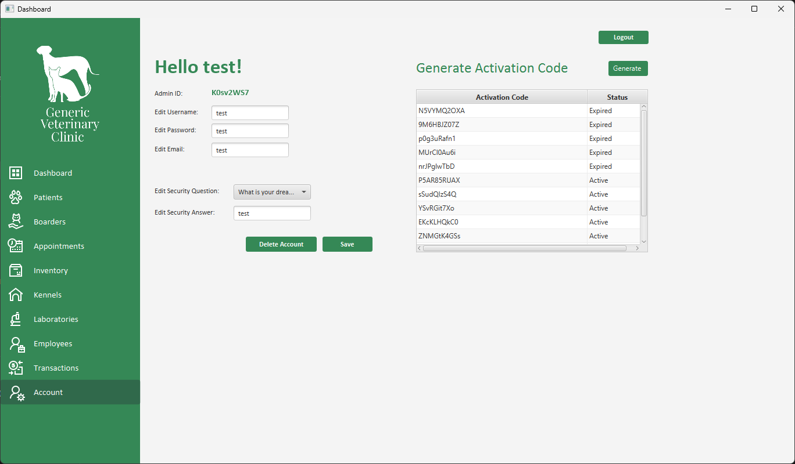
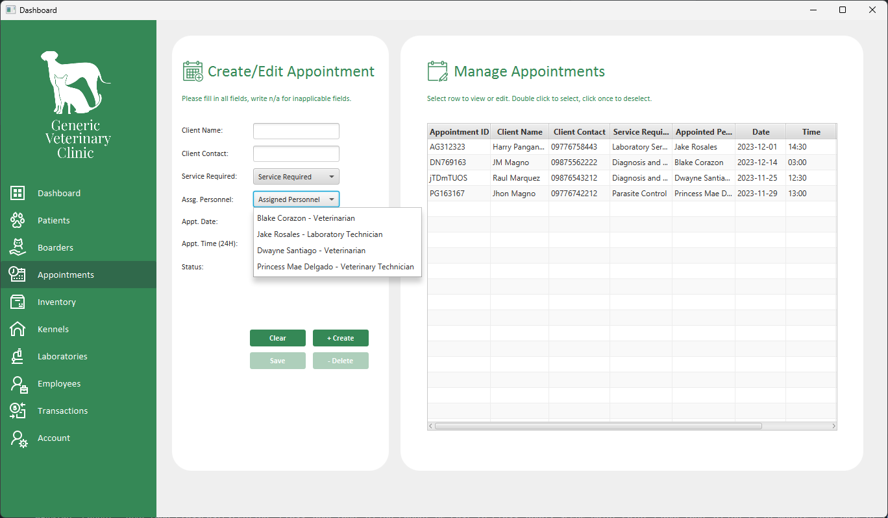
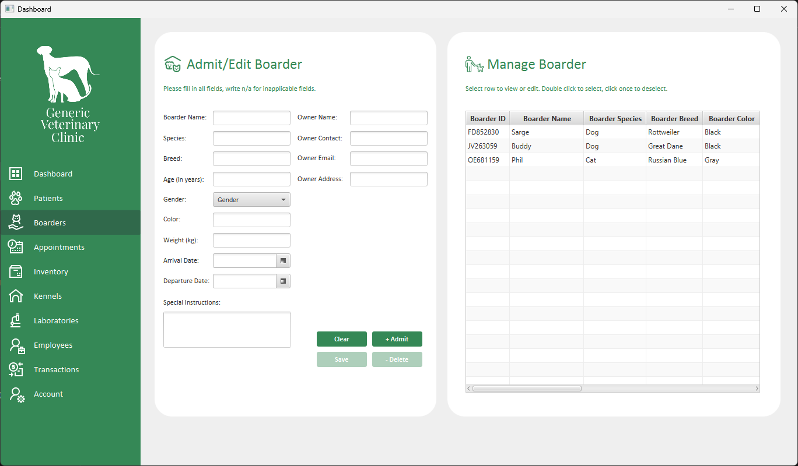
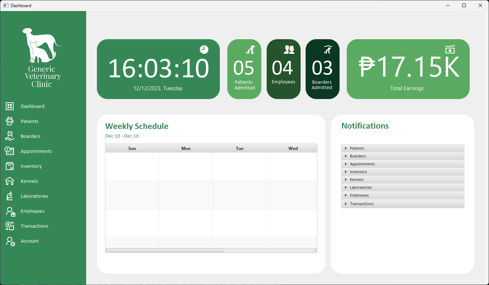
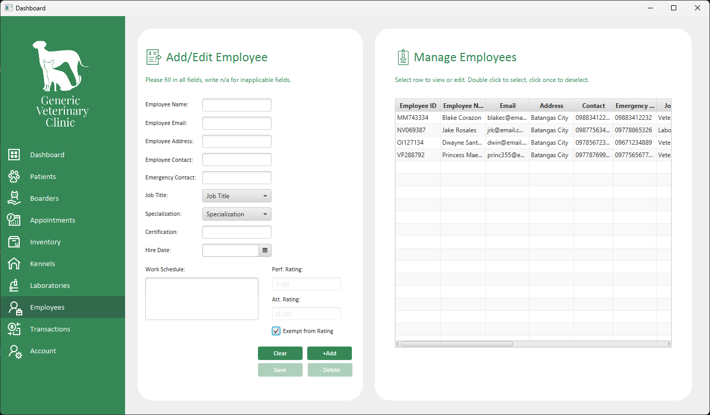
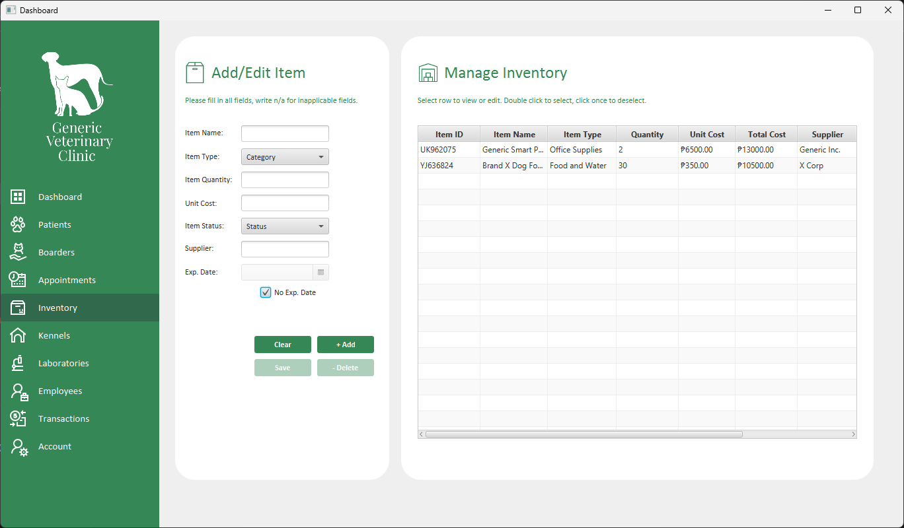
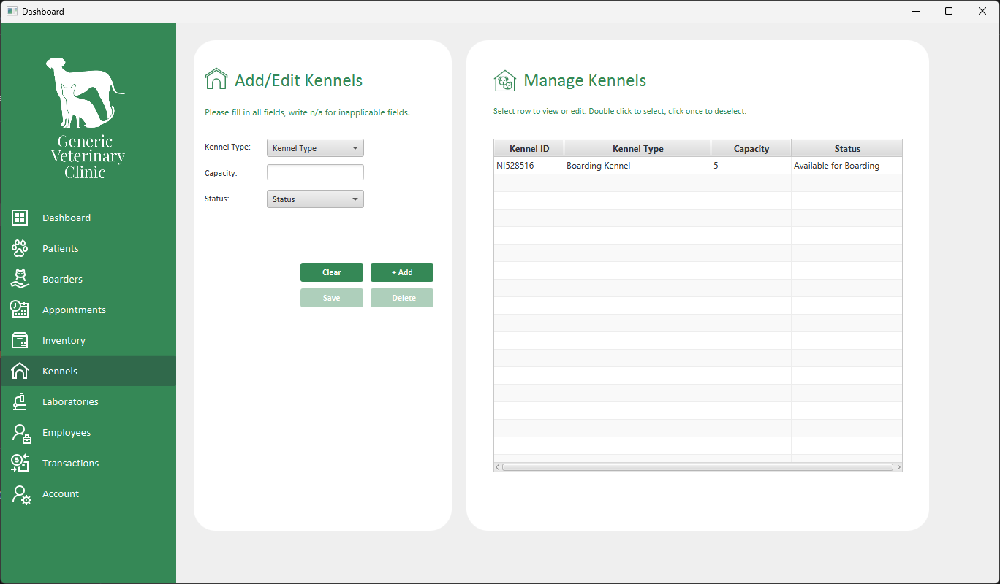
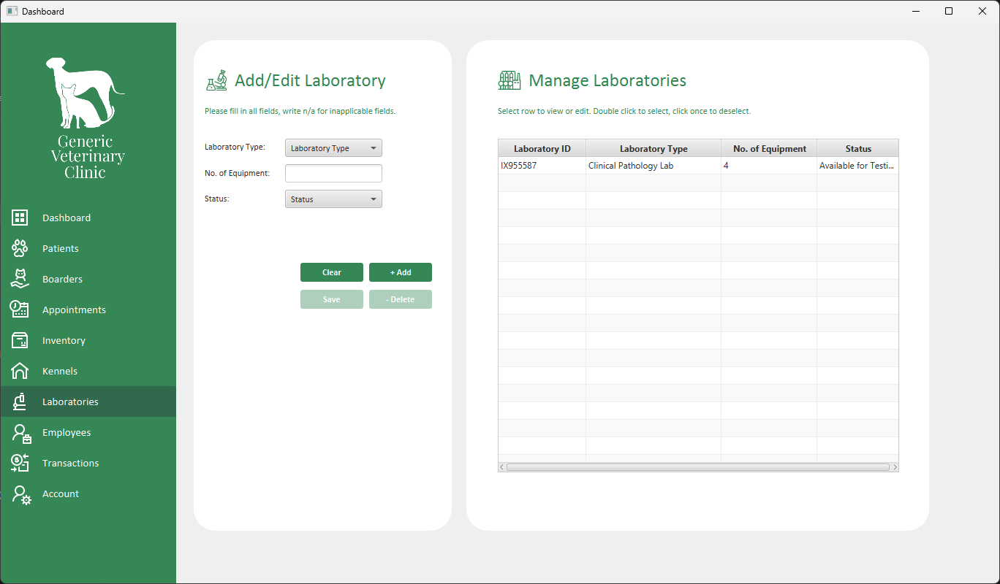
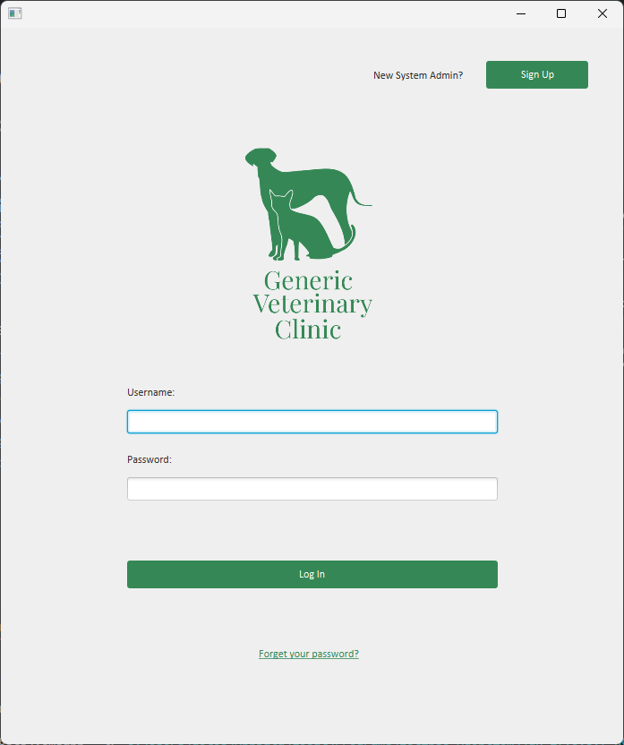
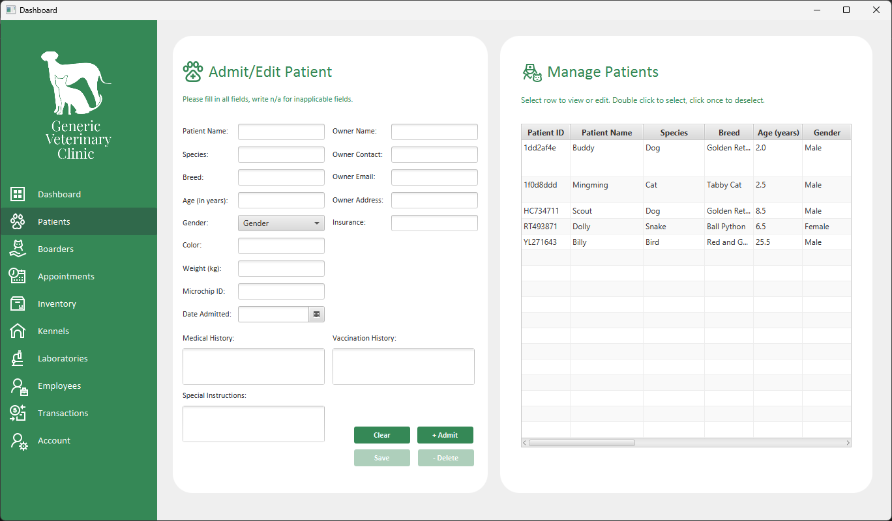

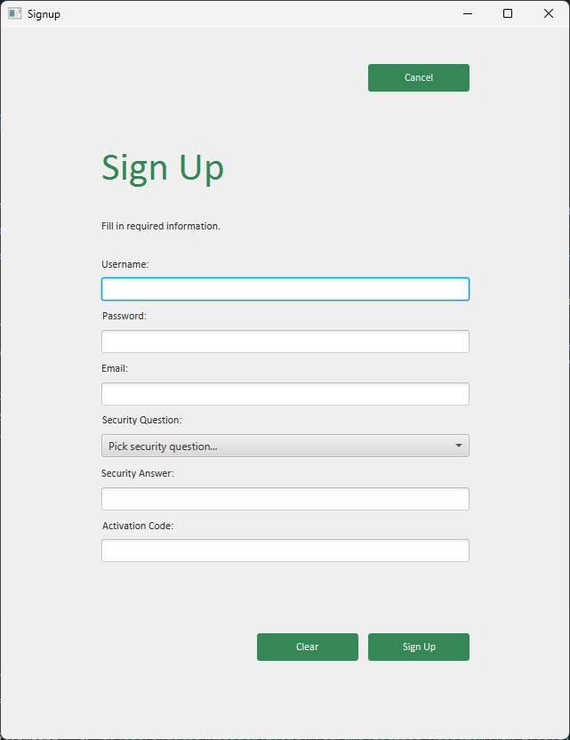
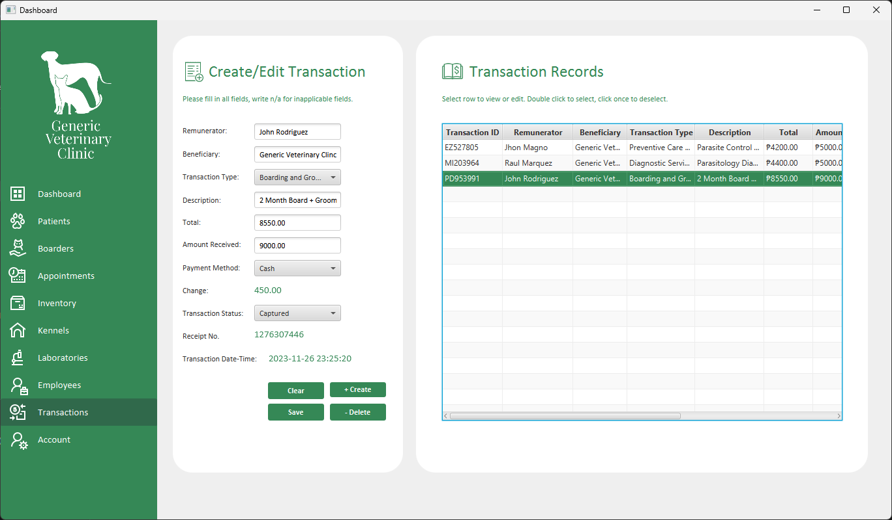

> **Note:** The information listed in the database is fictional and is provided solely for example and illustrative purposes. Any similarities with reali life individuals are pure conincidence.

> Icons by Icons8.

